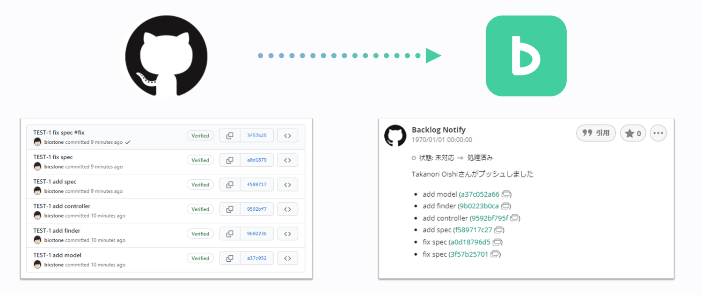

# Backlog Notify

[](https://github.com/bicstone/backlog-notify/actions/workflows/ci.yml)
[](https://github.com/bicstone/backlog-notify/actions/workflows/coverage.yml)
[](https://github.com/bicstone/backlog-notify/actions/workflows/njsscan-analysis.yml)
[](https://app.fossa.com/projects/git%2Bgithub.com%2Fbicstone%2Fbacklog-notify?ref=badge_shield)
[](https://sonarcloud.io/dashboard?id=bicstone_backlog-notify)
[](https://lgtm.com/projects/g/bicstone/backlog-notify/alerts/)
[](https://deepsource.io/gh/bicstone/backlog-notify/?ref=repository-badge)
[](https://codecov.io/gh/bicstone/backlog-notify)

Notify commit messages to [Backlog.com](https://backlog.com/) issue.

プッシュされたコミットメッセージを Backlog 課題のコメントに追加する GitHub Action です。キーワードによる課題の状態変更も可能です。

個人が開発した Action です。ヌーラボさまへのお問い合わせはご遠慮ください。



## 設定方法

### Backlog API キーの取得

1. Backlog のプロジェクトに移動します。
1. プロジェクト設定 → 参加ユーザー → 新しいユーザの追加はこちらから を選択します。
1. クラシックプランの場合は `一般ユーザ` 、新プランの場合は `ゲスト` を選択します。
1. 登録します。
1. 登録した BOT アカウントにログインします。
1. 個人設定 → API → 登録 で API キーを発行します。

### API キーを GitHub に登録

1. GitHub のリポジトリページに移動します。
1. Setting → Secrets → Add a new secret を選択します。
1. Name は `BACKLOG_API_KEY` とし、 Value に API キーをそのまま貼り付けます。
1. 登録します。

### collaborator による workflow の実行を制限

プライベートリポジトリの場合は下記の操作を行う必要はありません。  
パブリックリポジトリの場合は、collaborator からの workflow の実行を制限してください。

1. Setting → Actions → Fork pull request workflows from outside collaborators を開きます。
1. `Require approval for all outside collaborators` を選択します。

### Workflow の作成

GitHub Actions workflow を作成します (例: `.github/workflows/backlog-notify.yml` )。
下記のような形式である必要があります。

```yaml
name: Backlog Notify

on: push

jobs:
  notify:
    runs-on: ubuntu-latest

    steps:
      - name: Backlog Notify
        uses: bicstone/backlog-notify@v2
        with:
          # The following are required settings
          project_key: PROJECT_KEY
          api_host: example.backlog.jp
          api_key: ${{ secrets.BACKLOG_API_KEY }}

          # The following are optional settings
          fix_keywords: |-
            '#fix'
            '#fixes'
            '#fixed'
          close_keywords: |-
            '#close'
            '#closes'
            '#closed'
          push_comment_template: |-
            <%= commits[0].author.name %>さんがプッシュしました
            <% commits.forEach(commit=>{ %>\n+ <%= commit.message %> ([<%= commit.id_short %>](<%= commit.url %>))<% }); %>
          commit_message_reg_template: ^(<%= project_key %>\\-\\d+)\\s?(.*?)?\\s?(<% print(fixKeywords.join("|")) %>|<% print(closeKeywords.join("|")) %>)?$
          fix_status_id: 3
          close_status_id: 4
```

## 設定一覧

| 設定名                      | 説明                                 |
| --------------------------- | ------------------------------------ |
| project_key                 | Backlog プロジェクトキー (必須)      |
| api_host                    | Backlog のホスト (必須)              |
| api_key                     | Backlog API キー (必須)              |
| fix_keywords                | 処理済みにするキーワード             |
| close_keywords              | 完了にするキーワード                 |
| push_comment_template       | プッシュ時のコメント雛形             |
| commit_message_reg_template | コミットメッセージ解析の正規表現雛形 |
| fix_status_id               | 処理済みの 状態 ID                   |
| close_status_id             | 完了の 状態 ID                       |

## 使用方法

[Backlog の Git](https://support-ja.backlog.com/hc/ja/articles/360035640734) と同様です。課題キーは先頭にある 1 つ目のキーのみ認識します。  
付加機能として、コミットログで課題を操作することができます。

- `#fix` `#fixes` `#fixed` のどれかで処理済み
- `#close` `#closes` `#closed` のどれかで完了

例えば下記のようにコミットメッセージを設定してください。

```
PROJECT-123 不具合修正 #fix
```

大量にプッシュするとそのまま投稿され、 Backlog に負荷がかかるのでご注意ください。

## よくある質問と回答

- 何をプッシュしても実行に失敗し、ログに 401 エラーとある  
  →API キーが誤っている可能性があります。

- プロジェクトキーと課題キーが正しいのに実行に失敗し、ログに 404 エラーとある  
  → 該当 API キーのユーザーがプロジェクトに参加していない可能性があります。

## 貢献

コントリビューターの皆様に感謝いたします。

Thanks goes to these contributors.

<!-- ALL-CONTRIBUTORS-LIST:START - Do not remove or modify this section -->
<!-- prettier-ignore-start -->
<!-- markdownlint-disable -->
<table>
  <tr>
    <td align="center"><a href="https://bicstone.me/"><br /><sub><b>Oishi Takanori</b></sub></a><br /><a href="#ideas-bicstone" title="Ideas, Planning, & Feedback">🤔</a> <a href="https://github.com/bicstone/backlog-notify/commits?author=bicstone" title="Code">💻</a> <a href="#maintenance-bicstone" title="Maintenance">🚧</a> <a href="#question-bicstone" title="Answering Questions">💬</a> <a href="https://github.com/bicstone/backlog-notify/commits?author=bicstone" title="Documentation">📖</a> <a href="https://github.com/bicstone/backlog-notify/pulls?q=is%3Apr+reviewed-by%3Abicstone" title="Reviewed Pull Requests">👀</a></td>
    <td align="center"><a href="https://github.com/stmon19"><br /><sub><b>takeshi.kondo</b></sub></a><br /><a href="https://github.com/bicstone/backlog-notify/issues?q=author%3Astmon19" title="Bug reports">🐛</a> <a href="https://github.com/bicstone/backlog-notify/commits?author=stmon19" title="Code">💻</a></td>
    <td align="center"><a href="http://suzuken.hatenablog.jp/"><br /><sub><b>Kenta SUZUKI</b></sub></a><br /><a href="https://github.com/bicstone/backlog-notify/commits?author=suzuken" title="Documentation">📖</a></td>
    <td align="center"><a href="https://twitter.com/_mantaroh_"><br /><sub><b>mantaroh</b></sub></a><br /><a href="#ideas-mantaroh" title="Ideas, Planning, & Feedback">🤔</a></td>
  </tr>
</table>

<!-- markdownlint-restore -->
<!-- prettier-ignore-end -->

<!-- ALL-CONTRIBUTORS-LIST:END -->

貢献はいつでも大歓迎です。事前に [CONTRIBUTING.md](CONTRIBUTING.md) をご確認ください。

Contributions of any kind welcome! Please read [CONTRIBUTING.md](CONTRIBUTING.md).

## ライセンス

MIT License

[](https://app.fossa.com/projects/git%2Bgithub.com%2Fbicstone%2Fbacklog-notify?ref=badge_large)
