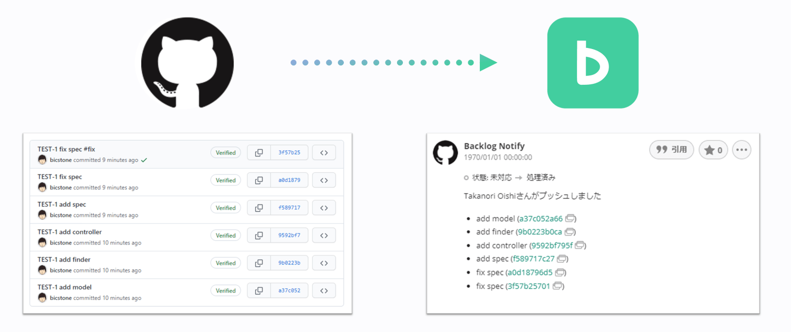
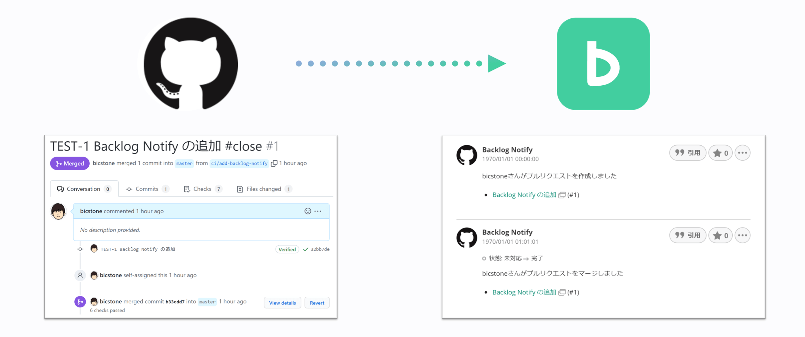

# Backlog Notify

[](https://github.com/bicstone/backlog-notify/actions/workflows/ci.yml)
[](https://app.fossa.com/projects/git%2Bgithub.com%2Fbicstone%2Fbacklog-notify?ref=badge_shield)

Notify commit messages to [Backlog.com](https://backlog.com/) issue.

GitHub 上のプッシュとプルリクエストを Backlog 課題に連携する GitHub Action です。キーワードによる課題の状態変更も可能です。

個人が開発した Action です。ヌーラボ様へのお問い合わせはご遠慮ください。

## 機能

### プッシュ



コミットメッセージの中に課題番号 (例: `PROJECT-123` ) がある場合は、その課題にコミットログに関するコメントを送信します。課題キーは先頭にある 1 つのみ認識します。

```plan
PROJECT-123 不具合修正
```

また、キーワードがある場合は、プッシュされたタイミングで課題ステータスを変更します。キーワードは末尾にある 1 つのみ認識します。

- `#fix` `#fixes` `#fixed` のどれかで処理済み
- `#close` `#closes` `#closed` のどれかで完了

```plan
PROJECT-123 不具合修正 #fix
```

※ 大量にプッシュするとそのまま投稿され、 Backlog に負荷がかかるのでご注意ください。

### プルリクエスト



プルリクエストのタイトルの中に課題番号 (例: `PROJECT-123` ) がある場合は、その課題にプルリクエストに関するコメントを送信します。課題キーは先頭にある 1 つのみ認識します。

```plan
PROJECT-123 不具合修正
```

また、キーワードがある場合は、マージされたタイミングで課題ステータスを変更します。キーワードは末尾にある 1 つのみ認識します。

- `#fix` `#fixes` `#fixed` のどれかで処理済み
- `#close` `#closes` `#closed` のどれかで完了

```plan
PROJECT-123 不具合修正 #fix
```

※ プルリクエストが Draft の状態である場合はコメント送信・ステータス操作をしません。  
※ タイトルを変更した場合の通知は今のところ対応していません(対応予定)。Close → タイトルを変更 → Reopen を行うと通知されます。

## 設定方法

### Backlog API キーの取得

1. Backlog のプロジェクトに移動します。
1. プロジェクト設定 → 参加ユーザー → 新しいユーザの追加はこちらから を選択します。
1. クラシックプランの場合は `一般ユーザ` 、新プランの場合は `ゲスト` を選択します。
1. 登録します。
1. 登録した BOT アカウントにログインします。
1. 個人設定 → API → 登録 で API キーを発行します。

### API キーを GitHub に登録

1. GitHub のリポジトリページに移動します。
1. Setting → Secrets → Add a new secret を選択します。
1. Name は `BACKLOG_API_KEY` とし、 Value に API キーをそのまま貼り付けます。
1. 登録します。

### collaborator による workflow の実行を制限

プライベートリポジトリの場合は下記の操作を行う必要はありません。  
パブリックリポジトリの場合は、collaborator からの workflow の実行を制限してください。

1. Setting → Actions → Fork pull request workflows from outside collaborators を開きます。
1. `Require approval for all outside collaborators` を選択します。

### Workflow の作成

GitHub Actions workflow を作成します (例: `.github/workflows/backlog-notify.yml` )。

```yaml
name: Backlog Notify

on:
  push:
  pull_request:
    types:
      - opened
      - reopened
      - ready_for_review
      - closed

jobs:
  notify:
    runs-on: ubuntu-latest
    steps:
      - name: Backlog Notify
        uses: bicstone/backlog-notify@bed3fe95e306428ee0992a90a1f5bbfc9c9839d2 # v6.1.1
        with:
          project_key: PROJECT_KEY
          api_host: example.backlog.jp
          api_key: ${{ secrets.BACKLOG_API_KEY }}
```

## 高度な設定

[Workflow syntax for GitHub Actions - GitHub Docs](https://docs.github.com/ja/actions/using-workflows/workflow-syntax-for-github-actions#on) を参照に実行する条件を制御することができます。
また、コメントのフォーマットや、メッセージを解析する際の正規表現などをカスタマイズすることもできます。

```yaml
name: Backlog Notify

on:
  push:
    branches:
      - main
  pull_request:
    types:
      - opened
      - reopened
      - ready_for_review
      - closed
    branches:
      - releases/**

jobs:
  notify:
    runs-on: ubuntu-latest
    steps:
      - name: Backlog Notify
        uses: bicstone/backlog-notify@bed3fe95e306428ee0992a90a1f5bbfc9c9839d2 # v6.1.1
        with:
          # 必須設定 (The following are required settings)
          project_key: PROJECT_KEY
          api_host: example.backlog.jp
          api_key: ${{ secrets.BACKLOG_API_KEY }}

          # 任意設定 (The following are optional settings)
          fix_keywords: |-
            #fix
            #fixes
            #fixed
          close_keywords: |-
            #close
            #closes
            #closed
          push_comment_template: |-
            <%= commits[0].author.name %>さんが[<%= ref.name %>](<%= ref.url %>)にプッシュしました
            <% commits.forEach(commit=>{ %>
            + [<%= commit.comment %>](<%= commit.url %>) (<% print(commit.id.slice(0, 7)) %>)<% }); %>
          pr_opened_comment_template: |-
            <%= sender.login %>さんがプルリクエストを作成しました

            + [<%= title %>](<%= pr.html_url %>) (#<%= pr.number %>)
          pr_reopened_comment_template: |-
            <%= sender.login %>さんがプルリクエストを作成しました

            + [<%= title %>](<%= pr.html_url %>) (#<%= pr.number %>)
          pr_ready_for_review_comment_template: |-
            <%= sender.login %>さんがプルリクエストを作成しました

            + [<%= title %>](<%= pr.html_url %>) (#<%= pr.number %>)
          pr_closed_comment_template: |-
            <%= sender.login %>さんがプルリクエストをクローズしました

            + [<%= title %>](<%= pr.html_url %>) (#<%= pr.number %>)
          pr_merged_comment_template: |-
            <%= sender.login %>さんがプルリクエストをマージしました

            + [<%= title %>](<%= pr.html_url %>) (#<%= pr.number %>)
          commit_message_reg_template: "\
            ^\
            (<%= projectKey %>\\-\\d+)\\s?\
            (.*?)?\\s?\
            (<% print(fixKeywords.join('|')) %>|<% print(closeKeywords.join('|')) %>)?\
            $\
            "
          pr_title_reg_template: "\
            ^\
            (<%= projectKey %>\\-\\d+)\\s?\
            (.*?)?\\s?\
            (<% print(fixKeywords.join('|')) %>|<% print(closeKeywords.join('|')) %>)?\
            $\
            "
          fix_status_id: 3
          close_status_id: 4
```

### 設定一覧

| 設定名                                 | 説明                                     |
| -------------------------------------- | ---------------------------------------- |
| `project_key`                          | Backlog プロジェクトキー (必須)          |
| `api_host`                             | Backlog のホスト (必須)                  |
| `api_key`                              | Backlog API キー (必須)                  |
| `fix_keywords`                         | 処理済みにするキーワード                 |
| `close_keywords`                       | 完了にするキーワード                     |
| `push_comment_template`                | プッシュ時のコメント雛形                 |
| `pr_opened_comment_template`           | プルリクエストオープン時のコメント雛形   |
| `pr_reopened_comment_template`         | プルリクエスト再オープン時のコメント雛形 |
| `pr_ready_for_review_comment_template` | プルリクエスト下書き解除時のコメント雛形 |
| `pr_closed_comment_template`           | プルリクエストクローズ時のコメント雛形   |
| `pr_merged_comment_template`           | プルリクエストマージ時のコメント雛形     |
| `commit_message_reg_template`          | コミットメッセージ解析の正規表現雛形     |
| `pr_title_reg_template`                | プルリクエストタイトル解析の正規表現雛形 |
| `fix_status_id`                        | 処理済みの 状態 ID                       |
| `close_status_id`                      | 完了の 状態 ID                           |

#### `push_comment_template`

プッシュ時のコメントの雛形を変更できます。  
構文については [lodash/template](https://lodash.com/docs/4.17.15#template) をご参照ください。

<details>

<summary>使用可能な変数</summary>

| 変数名    | 型             |
| --------- | -------------- |
| `commits` | ParsedCommit[] |
| `ref`     | ParsedRef      |

ParsedCommit

| 変数名      | 型        |
| ----------- | --------- |
| `id`        | string    |
| `tree_id`   | string    |
| `distinct`  | boolean   |
| `message`   | string    |
| `timestamp` | string    |
| `url`       | string    |
| `author`    | Committer |
| `committer` | Committer |
| `added`     | string[]  |
| `modified`  | string[]  |
| `removed`   | string[]  |
| `issueKey`  | string    |
| `comment`   | string    |
| `keywords`  | string    |
| `isFix`     | boolean   |
| `isClose`   | boolean   |

ParsedRef

| 変数名 | 型     |
| ------ | ------ |
| `name` | string |
| `url`  | string |

Committer

| 変数名     | 型                      |
| ---------- | ----------------------- |
| `name`     | string                  |
| `email`    | string &#124; null      |
| `date`     | string &#124; undefined |
| `username` | string &#124; undefined |

</details>

#### `pr_*_comment_template`

プルリクエストイベントのコメントの雛形を変更できます。  
構文については [lodash/template](https://lodash.com/docs/4.17.15#template) をご参照ください。

<details>

<summary>使用可能な変数</summary>

| 変数名     | 型                                                                      |
| ---------- | ----------------------------------------------------------------------- |
| `pr`       | PullRequest                                                             |
| `action`   | "opened" &#124; "reopened" &#124; "ready_for_review" &#124; "closed" ※1 |
| `sender`   | User                                                                    |
| `issueKey` | string                                                                  |
| `title`    | string ※2                                                               |
| `keywords` | string                                                                  |
| `isFix`    | boolean                                                                 |
| `isClose`  | boolean                                                                 |

※1 マージとクローズは共に `"closed"` となります。マージかどうか判別したい場合は `pr.merged` を参照ください。  
※2 課題キーとキーワードを除いたタイトルです。加工前のタイトルは `pr.title` を参照ください。

PullRequest

[Get a pull request - GitHub Docs](https://docs.github.com/en/rest/pulls/pulls#get-a-pull-request) の Response schema をご参照ください。

User

[Get the authenticated user - GitHub Docs](https://docs.github.com/en/rest/users/users#get-the-authenticated-user) の Response schema をご参照ください。

</details>

#### `commit_message_reg_template`

コミットメッセージ解析の正規表現雛形を変更できます。  
構文については [lodash/template](https://lodash.com/docs/4.17.15#template) をご参照ください。

<details>

<summary>使用可能な変数</summary>

| 変数名          | 型       |
| --------------- | -------- |
| `projectKey`    | string   |
| `fixKeywords`   | string[] |
| `closeKeywords` | string[] |

</details>

#### `pr_title_reg_template`

プルリクエストタイトル解析の正規表現雛形を変更できます。  
構文については [lodash/template](https://lodash.com/docs/4.17.15#template) をご参照ください。

<details>

<summary>使用可能な変数</summary>

| 変数名          | 型       |
| --------------- | -------- |
| `projectKey`    | string   |
| `fixKeywords`   | string[] |
| `closeKeywords` | string[] |

</details>

## よくある質問と回答

- 何をプッシュしても実行に失敗し、ログに 401 エラーとある  
  API キーが誤っている可能性があります。

- プロジェクトキーと課題キーが正しいのに実行に失敗し、ログに 404 エラーとある  
  該当 API キーのユーザーがプロジェクトに参加していない可能性があります。

## 貢献

コントリビューターの皆様に感謝いたします。

Thanks goes to these contributors.

<!-- ALL-CONTRIBUTORS-LIST:START - Do not remove or modify this section -->
<!-- prettier-ignore-start -->
<!-- markdownlint-disable -->
<table>
  <tbody>
    <tr>
      <td align="center" valign="top" width="14.28%"><a href="https://bicstone.me/"><br /><sub><b>Oishi Takanori</b></sub></a><br /><a href="#ideas-bicstone" title="Ideas, Planning, & Feedback">🤔</a> <a href="https://github.com/bicstone/backlog-notify/commits?author=bicstone" title="Code">💻</a> <a href="#maintenance-bicstone" title="Maintenance">🚧</a> <a href="#question-bicstone" title="Answering Questions">💬</a> <a href="https://github.com/bicstone/backlog-notify/commits?author=bicstone" title="Documentation">📖</a> <a href="https://github.com/bicstone/backlog-notify/pulls?q=is%3Apr+reviewed-by%3Abicstone" title="Reviewed Pull Requests">👀</a></td>
      <td align="center" valign="top" width="14.28%"><a href="https://github.com/stmon19"><br /><sub><b>takeshi.kondo</b></sub></a><br /><a href="https://github.com/bicstone/backlog-notify/issues?q=author%3Astmon19" title="Bug reports">🐛</a> <a href="https://github.com/bicstone/backlog-notify/commits?author=stmon19" title="Code">💻</a></td>
      <td align="center" valign="top" width="14.28%"><a href="http://suzuken.hatenablog.jp/"><br /><sub><b>Kenta SUZUKI</b></sub></a><br /><a href="https://github.com/bicstone/backlog-notify/commits?author=suzuken" title="Documentation">📖</a></td>
      <td align="center" valign="top" width="14.28%"><a href="https://twitter.com/_mantaroh_"><br /><sub><b>mantaroh</b></sub></a><br /><a href="#ideas-mantaroh" title="Ideas, Planning, & Feedback">🤔</a></td>
      <td align="center" valign="top" width="14.28%"><a href="https://github.com/hynjnk"><br /><sub><b>Hyunjoon KIM</b></sub></a><br /><a href="#ideas-hynjnk" title="Ideas, Planning, & Feedback">🤔</a> <a href="https://github.com/bicstone/backlog-notify/commits?author=hynjnk" title="Code">💻</a></td>
      <td align="center" valign="top" width="14.28%"><a href="https://github.com/shuyahonda"><br /><sub><b>Shuya Honda</b></sub></a><br /><a href="#ideas-shuyahonda" title="Ideas, Planning, & Feedback">🤔</a></td>
      <td align="center" valign="top" width="14.28%"><a href="https://github.com/ipavlushin"><br /><sub><b>Ivan Pavlushin</b></sub></a><br /><a href="#ideas-ipavlushin" title="Ideas, Planning, & Feedback">🤔</a> <a href="https://github.com/bicstone/backlog-notify/commits?author=ipavlushin" title="Code">💻</a></td>
    </tr>
  </tbody>
</table>

<!-- markdownlint-restore -->
<!-- prettier-ignore-end -->

<!-- ALL-CONTRIBUTORS-LIST:END -->

貢献はいつでも大歓迎です。事前に [CONTRIBUTING.md](CONTRIBUTING.md) をご確認ください。

Contributions of any kind welcome! Please read [CONTRIBUTING.md](CONTRIBUTING.md).

## ライセンス

MIT License

[](https://app.fossa.com/projects/git%2Bgithub.com%2Fbicstone%2Fbacklog-notify?ref=badge_large)
